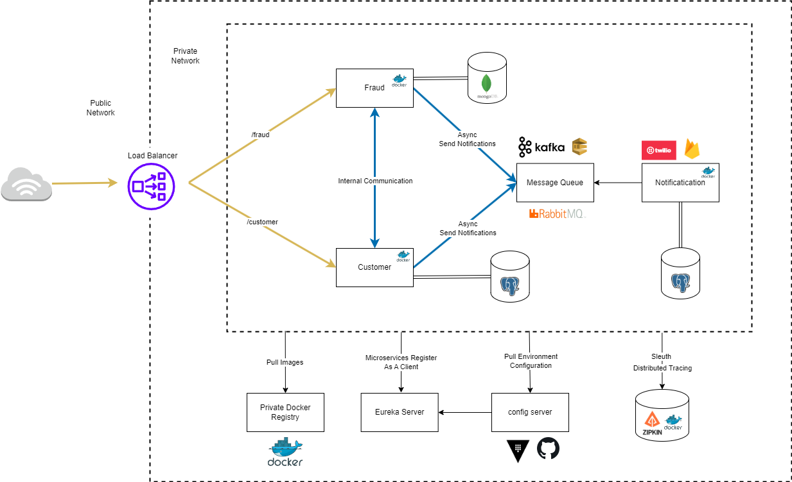

# Обзор проекта

## Название: Архитектура микросервисов в Spring Boot

## Описание:

Этот проект демонстрирует архитектуру микросервисов, реализованную с использованием Java и Spring Boot, предназначенную для образовательных целей. Архитектура включает в себя множество взаимосвязанных сервисов, каждый из которых играет ключевую роль в общей функциональности системы.

## Основные компоненты:

### Сервис клиентов:
Выступает в качестве точки входа для данных клиентов, которые затем хранятся в базе данных PostgreSQL. Построен с использованием Spring Boot и интегрируется с базой данных PostgreSQL для сохранения данных.

### Сервис проверки на мошенничество:
Этот сервис, доступный через OpenFeign из Сервиса клиентов, выполняет проверки на мошенничество. OpenFeign используется для декларативного создания REST-клиента в Spring.

### Сервис уведомлений:
Интегрируется с RabbitMQ, брокером сообщений, для управления очередями уведомлений. Сервис клиентов отправляет данные в RabbitMQ, которые затем обрабатываются Сервисом уведомлений для рассылки по электронной почте.

### Eureka Server:
Функционирует как сервер обнаружения, облегчая обнаружение и регистрацию сервисов в среде микросервисов. Это часть набора инструментов Spring Cloud, необходимая для оркестровки сервисов.

### Zipkin:
Используется для трассировки запросов в распределенной системе, помогает в мониторинге и устранении проблем с задержками.

### API Gateway:
Контролирует доступ к системе, выступая в качестве точки входа для всех клиентских запросов. Является неотъемлемой частью экосистемы Spring Cloud, обеспечивая безопасное и эффективное управление API.

### Docker & Kubernetes:
Все сервисы контейнеризированы с использованием Docker, что позволяет обеспечить единообразные среды развертывания. Kubernetes оркестрирует эти контейнеры, управляя развертыванием, масштабированием и операциями.

## Технологии и фреймворки:

Java & Spring Boot: Основной язык программирования и фреймворк. Spring Boot упрощает разработку автономных приложений на основе Spring, готовых к производственному использованию.

Spring Cloud: Предлагает инструменты для быстрой разработки распространенных паттернов в распределенных системах (например, управление конфигурацией, обнаружение сервисов).

OpenFeign: Декларативный веб-клиент в экосистеме Spring, упрощающий вызовы REST API.

RabbitMQ: Брокер сообщений, позволяющий осуществлять асинхронную обработку и разделение сервисов.

PostgreSQL: Открытая реляционная база данных, используемая для хранения данных клиентов.

Docker & Kubernetes: Docker упаковывает приложение и его зависимости в виртуальный контейнер, в то время как Kubernetes обеспечивает оркестровку контейнеров.

Диаграмма архитектуры:

Прилагается диаграмма архитектуры, иллюстрирующая взаимосвязи и поток между различными сервисами и компонентами.
